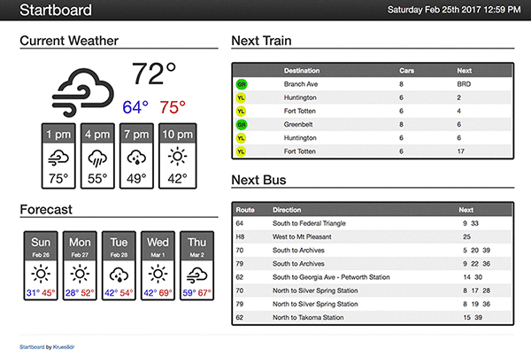

# Startboard

Startboard is an html page to show your local weather and train times. At the
moment, it is only integrated with [OpenWeatherMap](http://openweathermap.org/)
and [WMATA](https://developer.wmata.com/) (Washington, DC).

## Setup

* Copy the config.example.js file to config.js
* Enter your api credentials and location information into the config.js file:

  * Weather
    * Sign up for an [OpenWeatherMap](http://openweathermap.org/) API account.
    * Find your [zip code and location](http://openweathermap.org/current#zip), e.g. `20011,us`

  * Transit
    * Sign up for a [WMATA Developer](https://developer.wmata.com/) account.
    * Find your nearest train station ids. Once you are logged in, you can use the JSON Station List endpoint (use the `Try It` button).
    * Find your nearest bus stops. You'll have to search for these on [buseta.wmata.com](https://buseta.wmata.com/).
    * **Note**: In our config file, WMATA train station codes may be a comma-separated string (`"E01,E02"`) but bus stops must me an array (`[1003081, 1003082, 1003083]`). This is due to WMATA API limitations (and my laziness).
    * If there is more than one train station, we always show the station name.
    * If there is more than one bus stop, you must set `showstops: true` in your config to show the stop name.

* If you want, change the time settings to use military time, etc.

Once you have the app configured, you can set the `Index.html` file as your
browser's homepage.  In Chrome, you can also use the [Replace New Tab Page](https://chrome.google.com/webstore/detail/replace-new-tab-page/cnkhddihkmmiiclaipbaaelfojkmlkja) plugin to show this file on all new tabs.

## Background

After looking at projects like [MagicMirror2](https://magicmirror.builders/)
and [Tim Montague's Dashboard](https://github.com/timmontague/dashboard), I
wanted a way to show local information on my TV. Since I already have a computer
hooked up to it as a media center, I just needed to create an html page I could
load into a browser.

I didn't want to have to use a server to run this, so I that meant everything
must run client-side.  This means avoiding most messy OAuth, but also prevents
me from being able to load local JSON files due to [CORS](https://developer.mozilla.org/en-US/docs/Web/HTTP/Access_control_CORS).
Thus, all of our config must be in Javascript files.

## Credits

I've used and included the following packages in creating this:

* [Bootstrap](http://getbootstrap.com/) is released under the MIT license and is copyright 2016 Twitter.
* [Moment.js](https://momentjs.com/) is released under the MIT license.
* [Weather Icons](https://erikflowers.github.io/weather-icons/) are licensed under SIL OFL 1.1, Code licensed under MIT License, Documentation licensed under CC BY 3.0
* [JQuery](https://jquery.com/) is released under the Apache 2.0 license.
* [Modernizr](https://modernizr.com/) is released under the MIT license.

## License

Startboard is released under the [MIT license](LICENSE).
